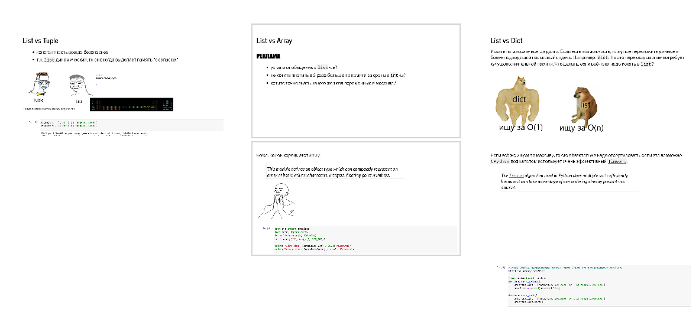

## Jupyter template for interactive workshops
You can run code in slides, show LateX formulas, make interactive visualizations.
Instructions and slide examples are in the `workshop.ipynb` notebook.

Get Conda here: https://www.anaconda.com/products/individual

```shell script
# install dependencies
conda install --name workshop_environment --file requirements.txt

# run, the notebook URL will be printed
jupyter notebook
```

## Overview
Screenshot of an overview of a memeful workshop:

